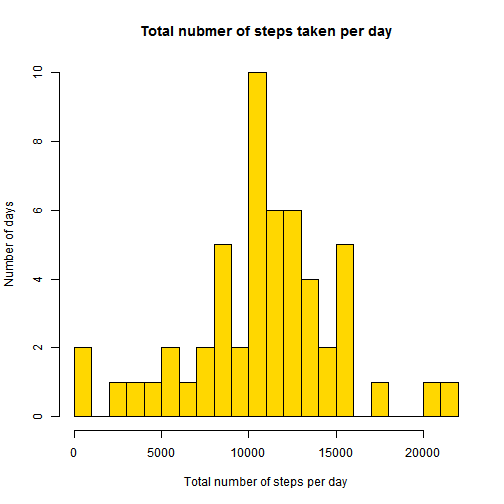
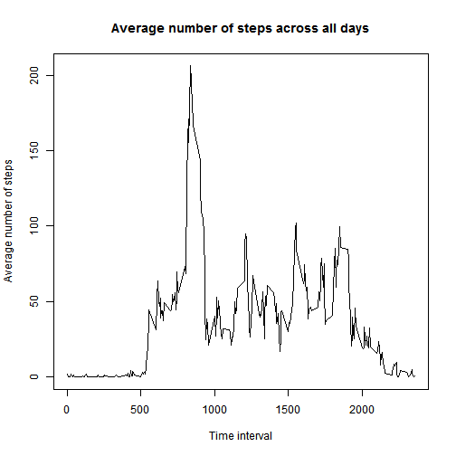
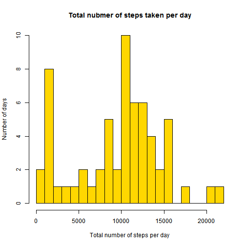
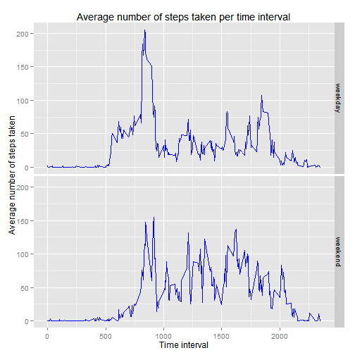

## Loading and preprocessing the data

First, we load the data

```r
data_dir <- 'data';
data_file <- 'activity.csv'
zipped_data_file <- 'activity.zip'

data_file_path <- file.path(data_dir, data_file);

# If the final data file does not exist, check for zipped data file. 
#   If it exists, unzip it and continue
#   If it does not exist, exit with error

if(!file.exists(data_file_path)) {
    cat('Data file <', data_file_path, '> is not found. Searching for ziped data file <', zipped_data_file, '>' );

    if(file.exists(zipped_data_file)) {
        cat('Zipped data file found. Unzipping data...');
        unzip(zipped_data_file, files = c(data_file), exdir = data_dir); 
    }
    else {
		stop(paste0("Cannot find either zipped or unzipped data file. Cannot continue without data!"));
    }
}

d <- read.csv(data_file_path);
```

Then clean it a bit. We completely exclude the dates for which there only datapoints with NAs are available. There is
too little information (none!) available for these dates to use them without imputation.


```r
library(dplyr)
```

```
## Warning: package 'dplyr' was built under R version 3.0.3
```

```
## 
## Attaching package: 'dplyr'
## 
## The following objects are masked from 'package:stats':
## 
##     filter, lag
## 
## The following objects are masked from 'package:base':
## 
##     intersect, setdiff, setequal, union
```

```r
library(magrittr)
```

```
## Warning: package 'magrittr' was built under R version 3.0.3
```

```
## 
## Attaching package: 'magrittr'
## 
## The following object is masked from 'package:dplyr':
## 
##     %>%
```

```r
d_agg_perday <- d %>% 
    group_by(date) %>% 
    summarize(
        any_steps_not_NA = any(!is.na(steps))          # Flag indicating if there is any non-NA data available for the
                                                       # date
    )
```
Then we get the dates that only have `NA` entries in the dataset and produce a new dataset that excludes them


```r
na_dates <- d_agg_perday %>% filter(any_steps_not_NA == FALSE) %>% select(date)

d.no_na_dates <- filter(d, !(date %in% na_dates$date))
```

## What is mean total number of steps taken per day?

We continue using `dplyr` package. First, we aggregate the data ignoring the NAs

```r
d_agg_perday <- d.no_na_dates %>% 
    group_by(date) %>% 
    summarize(
        sum_steps = sum(steps, na.rm = TRUE)
        ,mean_steps = mean(steps, na.rm = TRUE)
        ,median_steps = median(steps, na.rm = TRUE)
        ,cnt_datapoints = n()
        # Flag indicating if there is any non-NA data available for the date (should be TRUE for all after cleaning)
        ,any_steps_not_NA = any(!is.na(steps))          
    )
```

Then present our finding as a histogram of the total number of steps taken each day


```r
hist(
    d_agg_perday$sum_steps
    ,breaks = 25
    ,col = "gold"
    ,main = 'Total nubmer of steps taken per day'
    ,xlab = 'Total number of steps per day'
    ,ylab = 'Number of days'
)
```

 

and summary for the total number of steps taken per day: 
- mean = 1.0766189 &times; 10<sup>4</sup>
- median = 10765

## What is the average daily activity pattern?

First, aggregate the data ignoring the NAs

```r
d_agg_perintl <- d.no_na_dates %>% 
    group_by(interval) %>% 
    summarize(
        sum_steps = sum(steps, na.rm = TRUE)
        ,mean_steps = mean(steps, na.rm = TRUE)
        ,median_steps = median(steps, na.rm = TRUE)
        ,cnt_datapoints = n()
        ,any_steps_not_NA = any(!is.na(steps))          # Flag indicating if there is any non-NA data available for the
                                                        # date (should be all TRUE after cleaning)
    )
```

Let's plot the data


```r
plot(d_agg_perintl$interval, d_agg_perintl$mean_steps, type = "l", main = 'Average number of steps across all days',
xlab = 'Time interval', ylab = 'Average number of steps')
```

 

Since the number of datapoints per day and interval is the same (only full days were removed during cleaning, so these
numbers are intact), the order on sum and mean is the same (mean = sum/n and n's are all equal)


```r
ind_intl_max_sum <- which.max(d_agg_perintl$sum_steps)
```
Interval with the maximum number of steps (on average across all days in the dataset) is 835. Its mean number of steps is 206.17.

## Imputing missing values

Check for the missing values


```r
cnt_incomplete_entries <- sum(!complete.cases(d));
cnt_entries <- dim(d)[1];
if( cnt_incomplete_entries > 0 ) {
    cat('Achtung! The data contains incomplete entries (where at least one variable has value of NA.', "\n");
    cat(paste0('Count = ', cnt_incomplete_entries, ', percentage = ', 
        round(cnt_incomplete_entries/cnt_entries*100, 2), "%\n"));
}
```

```
## Achtung! The data contains incomplete entries (where at least one variable has value of NA. 
## Count = 2304, percentage = 13.11%
```

And impute the missing values by the median values per interval averaged across all days


```r
d.imputed <- d;

for(i in seq_along(d.imputed$steps)){
    if(is.na(d.imputed$steps[i])) {
        d.imputed$steps[i] <- d_agg_perintl$median_steps[d_agg_perintl$interval == d.imputed$interval[i]];
    }
}
```

Aggregate the data NOT ignoring the NAs (there should be none)


```r
d_agg_perday <- d.imputed %>% 
    group_by(date) %>% 
    summarize(
        sum_steps = sum(steps)
        ,mean_steps = mean(steps)
        ,median_steps = median(steps)
        ,cnt_datapoints = n()
        ,any_steps_not_NA = any(!is.na(steps))   
    )
```

And visualize it as a histogram


```r
hist(
    d_agg_perday$sum_steps
    ,breaks = 25
    ,col = "gold"
    ,main = 'Total nubmer of steps taken per day'
    ,xlab = 'Total number of steps per day'
    ,ylab = 'Number of days'
)
```

 

and a summary for the total number of steps taken per day: 
- mean = 9503.8688525
- median = 10395


## Are there differences in activity patterns between weekdays and weekends?

Using `lubridate` for operations with dates we create a factor variable with 'weekday' and 'weekend' levels


```r
library(lubridate)
```

```
## Warning: package 'lubridate' was built under R version 3.0.3
```

```r
# wday returns the day of the week as decimal. 
#   (Sun = 1, Sat = 7) => weekend
#   (everything else) => weekday
d.imputed %<>% mutate(
    week_period = as.factor(ifelse(wday(ymd(date)) %in% c(1,7), 'weekend', 'weekday'))
);

# Note: assume no NAs in imputed data
d_agg_per_weekperiod_intl <- d.imputed %>% 
    group_by(week_period, interval) %>% 
    summarize(
        sum_steps = sum(steps)
        ,mean_steps = mean(steps)
        ,median_steps = median(steps)
        ,cnt_datapoints = n()
    )
```

And now we summon `ggplot2` for final visualiztion


```r
library(ggplot2)
p <- ggplot(d_agg_per_weekperiod_intl, aes(interval, mean_steps)) + 
    geom_line(colour = 'blue') +
    facet_grid(week_period ~ .) +
    ggtitle('Average number of steps taken per time interval') + 
    xlab('Time interval') +
    ylab('Average number of steps taken')

print(p)
```

 
